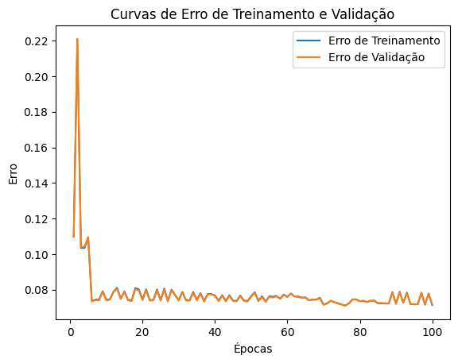

# Transformação e Limpeza Automatizada de Dados com Redes MLP

### Integrantes

|Nome                       |                          
|---------------------------|
|Gustavo Bido               |
|Neoaquison Medeiros        |
|Rafael Medeiros dos Santos |
|Samuel                     |
|Vinícius Soares            |
|                           |

### Visão Geral

Este repositório contém um estudo de caso que explora o uso de Redes Neurais Multicamadas (MLP) para a detecção e correção automática de inconsistências em dados de entrada. O sistema proposto foca em tarefas de limpeza e transformação de dados, como a correção de valores nulos, tratamento de outliers e formatação de dados para integração em pipelines de agregação de dados.

### Objetivo
O objetivo deste projeto é demonstrar como uma rede MLP pode ser aplicada para:

- Identificar dados inconsistentes (dados "sujos")
- Limpar automaticamente os dados, tratando outliers e valores ausentes
- Transformar os dados para atender às formatações desejadas

### Arquitetura do projeto
O sistema desenvolvido consiste nas seguintes etapas:

1. Coleta de Dados: Para o projeto, foram utilizados dados ficticios de transacões financeiras de clientes.
2. Preprocessamento de Dados: Detecção de valores nulos, outliers e erros de formatação.
3. Treinamento da Rede MLP: A rede MLP é treinada com dados rotulados para reconhecer padrões de inconsistência e aplicar correções automáticas.
4. Analíse de resultados: Após o treinamento do modelo, são realizadas análises do resultado.

### Estudo de Caso
No estudo de caso, a MLP foi utilizada para processar grandes volumes de dados de um sistema de agregação, onde foram encontradas as seguintes inconsistências:

- Valores nulos 
- Valores Outliers 
- Erros de formatação 

## Discussão
### Como treinar uma MLP para identificar dados sujos ou inconsistentes?
Para treinar a MLP, é necessário construir um conjunto de dados rotulado, contendo exemplos de dados "sujos" e "limpos". Isso envolve definir os tipos de inconsistências (nulos, outliers, erros de formatação), rotular os dados como sujos ou limpos e balancear a amostra para que haja equilibrio entre dados limpos e sujos.
O ideal é que se tenha um volume grande de dados com uma representação expressiva de ambos os tipos de rótulos.

### Quais desafios de escalabilidade existem para aplicar redes MLP em grandes volumes de dados em pipelines de produção?

A redes neurais necessitam de grandes quantidades de dados para inferir sobre os mesmo, então é necessário  uma grande capacidade de processamento para realizar os treinos. Geralmente são utilizados poderosos clusters ou GPUs.

## Conclusão

`Tamanho da base:` 500k linhas

### 1ª execução

### Parâmetros utilizados

### MLPClassifier

|Parâmetro            |Valor      |                          
|---------------------|-----------| 
|`hidden_layer_sizes` |(10,)      | 
|`activation`         |relu       | 
|`solver`             |adam       |   
|`batch_size`         |auto       |
|`learning_rate_init` |0.000098   |
|`momentum`           |0.9        |
|`early_stopping`     |True       |
|`max_iter`           |1          |
|`warm_start`         |True       |
|`random_state`       |42         |

`n_epochs` = 100

--------

### 2ª execução

### Parâmetros utilizados
 
### MLPClassifier

|Parâmetro            |Valor      |                          
|---------------------|-----------| 
|`hidden_layer_sizes` |(10,)      | 
|`activation`         |relu       | 
|`solver`             |adam       |   
|`batch_size`         |auto       |
|`learning_rate_init` |0.001      |
|`momentum`           |0.9        |
|`early_stopping`     |True       |
|`max_iter`           |100        |
|`warm_start`         |True       |
|`random_state`       |42         |

`n_epochs` = 100

--------

### 3ª execução

### Parâmetros utilizados
 
### MLPClassifier

|Parâmetro            |Valor      |                          
|---------------------|-----------| 
|`hidden_layer_sizes` |(10,)      | 
|`activation`         |relu       | 
|`solver`             |adam       |   
|`batch_size`         |512      |
|`learning_rate_init` |0.001      |
|`momentum`           |0.5        |
|`early_stopping`     |True       |
|`max_iter`           |100        |
|`warm_start`         |True       |
|`random_state`       |42         |

`n_epochs` = 100

--------

### 4ª execução

### Parâmetros utilizados
 
### MLPClassifier

|Parâmetro            |Valor      |                          
|---------------------|-----------| 
|`hidden_layer_sizes` |(10,3)     | 
|`activation`         |relu       | 
|`solver`             |adam       |   
|`batch_size`         |1024       |
|`learning_rate_init` |0.000009   |
|`momentum`           |0.5        |
|`early_stopping`     |True       |
|`max_iter`           |100        |
|`warm_start`         |True       |
|`random_state`       |42         |

`n_epochs` = 100

--------

### 5ª execução

`Tamanho da base:` 1k linhas

### Parâmetros utilizados
 
### MLPClassifier

|Parâmetro            |Valor      |                          
|---------------------|-----------| 
|`hidden_layer_sizes` |(10,)      | 
|`activation`         |relu       | 
|`solver`             |adam       |   
|`batch_size`         |auto       |
|`learning_rate_init` |0.000098   |
|`momentum`           |0.9        |
|`early_stopping`     |True       |
|`max_iter`           |1          |
|`warm_start`         |True       |
|`random_state`       |42         |

`n_epochs` = 100
